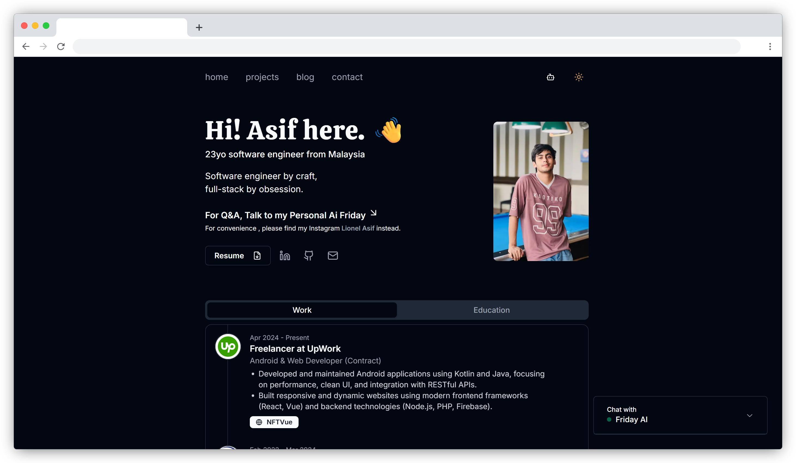

# My Personal Portfolio

A clean, minimal portfolio website built with Next.js, Tailwind CSS, and Shadcn UI. Features an AI chatbot, email contact form, and blog.

> Built this for fun and decided to open source it properly after getting lots of requests for permission to copy it\!

## Live Demo

🌐 Check it out here: **[https://masif.dev](https://masif.dev)**


## Features

  - Minimal design with Shadcn UI
  - Light/dark mode toggle
  - AI chatbot (Ted Support) trained on my portfolio content - please be nice to him\! 😊
  - Contact form with email integration
  - Responsive mobile design
  - Blog section

## Tech Stack

  - Next.js
  - Tailwind CSS
  - Shadcn UI
  - OpenAI API (chatbot)
  - Vercel (hosting)
  - **Vercel Postgres (vector storage)**
  - Upstash (caching)
  - Resend (email)

## Getting Started

1.  **Clone the repository:**

    ```bash
    git clone https://github.com/masifislamm/masif.dev.git asif-portfolio
    cd asif-portfolio
    ```

2.  **Install dependencies:**

    ```bash
    npm install
    ```

3.  **Set up your environment variables:**

    ```bash
    cp .env.example .env.local
    ```

    Add your own API keys and Vercel Postgres credentials to `.env.local`.

4.  **Generate embeddings for the chatbot:**
    This step populates your database so the chatbot has content to work with.

    ```bash
    npm run gen
    ```

5.  **Run the development server:**

    ```bash
    npm run dev
    ```

## Environment Variables

You'll need to create a `.env.local` file and add the following variables. You can get the Vercel Postgres variables from your Vercel project's storage settings after creating and connecting the database.

```env
# Vercel Postgres
POSTGRES_URL="..."
POSTGRES_PRISMA_URL="..."
POSTGRES_URL_NON_POOLING="..."
POSTGRES_USER="..."
POSTGRES_HOST="..."
POSTGRES_PASSWORD="..."
POSTGRES_DATABASE="..."

# OpenAI
OPENAI_API_KEY="..."

# Upstash
UPSTASH_REDIS_REST_URL="..."
UPSTASH_REDIS_REST_TOKEN="..."

# Resend
RESEND_API_KEY="..."
```

## Customization

  - Update personal info in `src/data/*.json`
  - Replace projects in `src/data/projects.json`
  - Replace blog posts in `content/` or remove it.
  - Add your resume to `public/resume.pdf`
  - Modify chatbot prompt in `src/app/api/chat/route.ts`

## Deployment

Deploy to Vercel:

1.  Push your code to a GitHub repository.
2.  Connect the repository to a new Vercel project.
3.  Add all the necessary environment variables in the Vercel project settings.
4.  Vercel will automatically build and deploy your site.

## Costs

  - OpenAI API: \~$5
  - Domain: \~$15/year
  - Hosting/DB: Free tiers

## License

MIT

Feel free to fork and make it your own\! Would love to see what you guys build with it ✨